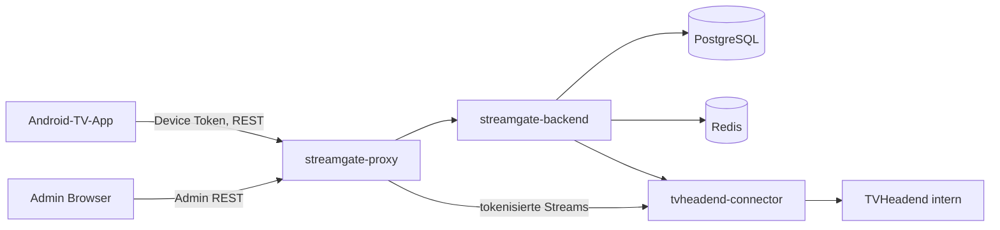
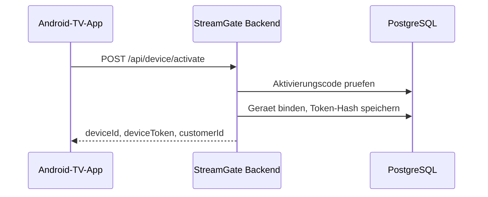
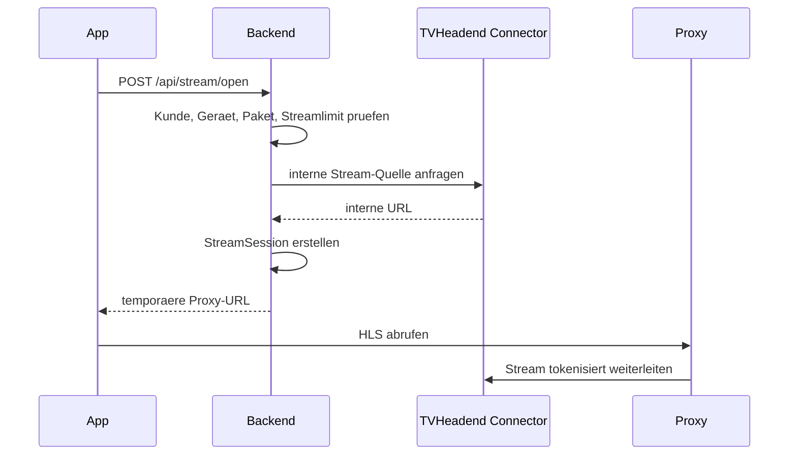

# StreamGate Architektur

## Zielbild

StreamGate trennt konsequent Client, Middleman-Verwaltung und TVHeadend. Android-TV-Clients sprechen nur mit StreamGate. StreamGate prueft Kundenstatus, Geraetestatus, Paketberechtigungen und Streamlimits, bevor eine temporaere Stream-URL erzeugt wird.

## Komponentenabgrenzung

- `streamgate-backend`: fuehrt Kunden, Geraete, Aktivierungscodes, Pakete, Sender, StreamSessions, DVR-Proxy-Metadaten, Bootstrap und Admin-API.
- `streamgate-admin`: operative Verwaltungsoberflaeche. Keine direkte TVHeadend-Verbindung.
- `streamgate-android-tv`: reiner Client mit TokenStorage, lokaler letzter gueltiger Konfiguration und Media3-Player.
- `streamgate-tvheadend-connector`: kapselt TVHeadend-API, Mock-Daten und interne Stream-URL-Erzeugung.
- `streamgate-proxy`: HTTPS-Terminierung im Zielbetrieb, API-Routing und Stream-Proxy fuer temporaere URLs.

## Datenfluss: Aktivierung

## Datenfluss: Stream oeffnen

## Service-Entscheidung

Der TVHeadend-Connector ist als eigener Service angelegt, damit TVHeadend-spezifische API-Details, Credentials und spaetere User-Mapping-Logik isoliert bleiben. Das Backend haelt die fachlichen Entscheidungen. Der Proxy ist eigenstaendig, weil Stream-Auslieferung und API-Verwaltung unterschiedliche Skalierungsprofile haben.
